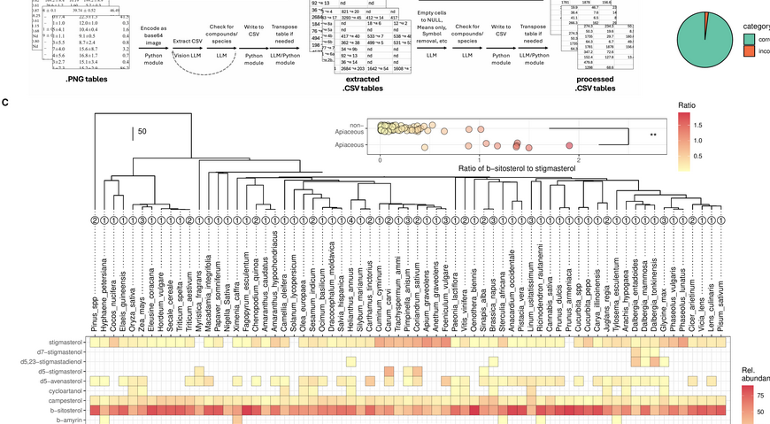

# Advancing Plant Metabolic Research with Large Language Models

## Overview
This project explores scalable approaches in plant metabolism research by using large language models to extract structured data from the extensive body of plant science literature. The ability of these models to distill information from scientific texts opens up the possibility of developing unified, specialized databases that capture and integrate chemical and metabolic data from a wide array of published resources. This repository hosts the raw data and code necessary to reproduce the findings discussed in the article.

## Data
The repository includes all raw data used in this research. The data is organized for straightforward replication of results and serves as a foundation for further research into plant chemical and metabolic diversity.

## Code
The provided scripts allow for end-to-end replication of the project results, with comments throughout to facilitate understanding. The code can be adapted and extended for similar analyses or applied to other datasets in plant metabolism research.

## Results
Our analysis assesses the effectiveness of language models in structuring plant metabolic data. Specifically, we tested three methods:
1. **Prompt Engineering**: We explored prompt engineering techniques and different model sizes to identify validated enzyme-product pairs from public protein databases.
2. **Automated Prompt Engineering and Retrieval-Augmented Generation**: These techniques were used to identify compound-species associations from scientific text.
3. **Multimodal Pipeline**: We built and evaluated a pipeline using a multimodal language model to transcribe table images into machine-readable data.

These methods achieved reasonably high accuracy, illustrating the potential of language models in the field.

## License
This project is licensed under the MIT License. See the `LICENSE.md` file for details.

## Citation
If you use the data or code from this project in your research, please cite it as follows:
> Knapp, Johnson, and Busta. (2024) Advancing Plant Metabolic Research with Large Language Models. DOI: URL

For any questions or further information, please open an issue or contact the repository maintainers directly.
